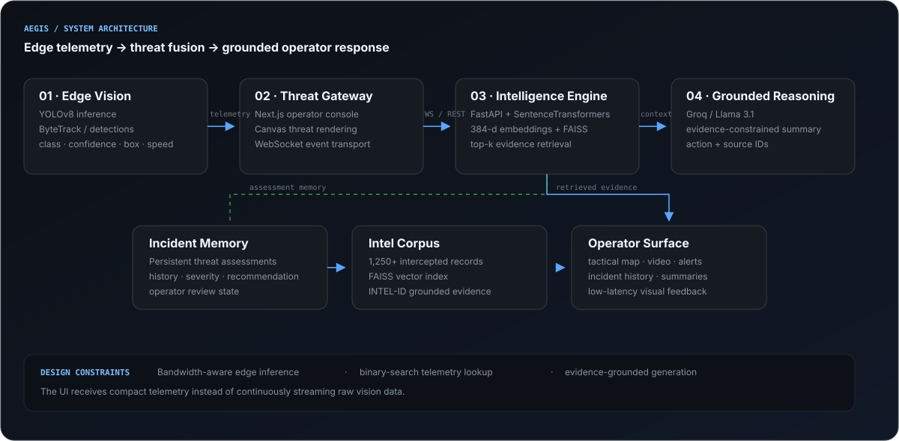
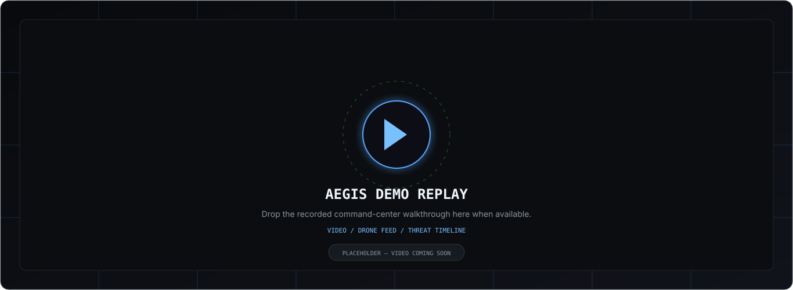

<div align="center">

# AEGIS COMMAND
### AI-Assisted Tactical Intelligence & Decision Support

**Computer Vision · Retrieval-Augmented Intelligence · Real-Time Telemetry · Operator Decision Support**

Built by **Tanmay Jain · Aryan Garg · Rishabh Bansal**

</div>

---

> **Aegis Command turns fragmented surveillance signals into an evidence-grounded operational picture.**
>
> Video detections, intercepted intelligence and prior incidents become one operator-facing workflow instead of three disconnected sources of information.

## The Operator Experience

The system is designed around a simple loop: **detect → correlate → retrieve → assess**.

### Command Center

<p align="center">
  
</p>

The dashboard combines replay video, detection telemetry, tactical mapping, intelligence retrieval and threat state in one operating surface.

<table>
<tr>
<td width="50%" align="center">
  
  <br/><b>01 · Video & Detection</b><br/>
  <sub>YOLO-derived detection telemetry rendered over the surveillance feed.</sub>
</td>
<td width="50%" align="center">
  
  <br/><b>02 · Tactical Map</b><br/>
  <sub>Detection events projected into a bounded operational area.</sub>
</td>
</tr>
<tr>
<td width="50%" align="center">
  
  <br/><b>03 · Intelligence Retrieval</b><br/>
  <sub>Semantic evidence surfaced alongside the active event.</sub>
</td>
<td width="50%" align="center">
  
  <br/><b>04 · System Architecture</b><br/>
  <sub>Perception, transport, retrieval, reasoning and operator interaction.</sub>
</td>
</tr>
</table>

## Demo

<p align="center">
  
</p>

> 🎥 A full walkthrough will be added here after the recording is finalized.

---

## Why Aegis?

Surveillance systems can produce more information than an operator can efficiently correlate in real time.

A camera can identify an object. An intelligence record can provide context. Historical incidents can reveal patterns. Aegis connects those signals into a single decision-support workflow.

It is intentionally a **decision-support system**, not an autonomous decision-maker.

---

## System Architecture

<p align="center">
  
</p>

| Layer | Responsibility | Implementation |
|---|---|---|
| **Vision** | Detect and track objects from the replay feed | YOLOv8 + detection telemetry |
| **Threat Gateway** | Stream events and coordinate the live UI | Next.js + React + WebSockets |
| **Intelligence Retrieval** | Embed queries and retrieve relevant records | SentenceTransformers + FAISS |
| **Reasoning** | Produce evidence-grounded assessments | Groq + Llama 3.1 |
| **Incident Memory** | Persist and expose prior assessments | FastAPI + dedicated memory layer |

### What happens when a threat appears?

```text
Video / sensor input
        ↓
YOLO detection + tracking
        ↓
Compact threat telemetry
        ↓
WebSocket → FastAPI threat engine
        ↓
Semantic retrieval from FAISS
        ↓
Evidence-grounded LLM assessment
        ↓
Operator dashboard + incident memory
```

### Perception

The frontend replays `frontend/public/drone_feed.mp4` and uses the matching `frontend/public/detections.json` timeline to render object detections over the video.

Each event can carry class, confidence, bounding-box coordinates, movement information and projected map coordinates.

### Event transport

Threat assessment is asynchronous. The dashboard maintains a WebSocket connection to `/ws/threat-engine` so perception events can trigger downstream reasoning without blocking the UI.

### Retrieval

The intelligence layer uses `all-MiniLM-L6-v2` embeddings with a 384-dimensional FAISS index. Retrieval happens before generation so the language model receives relevant evidence instead of acting as the database itself.

### Grounded reasoning

The assessment layer returns reasoning, threat level/score and a recommended action while retaining the evidence context used to reach the assessment.

### Incident memory

Threat assessments can be persisted and reviewed later, allowing the operator workflow to retain an inspectable history rather than treating each event as ephemeral.

---

## Engineering Details

### ⚡ Efficient telemetry lookup

Detection timestamps are ordered and searched with a binary-search style lookup rather than scanning every frame on every update.

### 🔄 Asynchronous threat flow

The frontend uses WebSockets with reconnect handling and in-flight request protection so model latency does not become a UI lock-up.

### 🗺️ Bounded geo-projection

Video detections contain pixel coordinates rather than GPS coordinates. A deterministic projection maps detection centers into a bounded tactical operating box while clamping extreme values.

### 🧠 Retrieval before generation

Relevant evidence is retrieved first and then supplied to the reasoning layer, reducing the chance of treating unconstrained model output as the source of truth.

---

## Technology Stack

<div align="center">

`Next.js` · `React` · `TypeScript` · `Python` · `FastAPI` · `WebSockets` · `YOLOv8` · `FAISS` · `SentenceTransformers` · `Groq` · `Docker`

</div>

---

## Repository Structure

```text
Aegis-Command/
├── assets/
│   ├── architecture.svg
│   ├── demo-video-placeholder.svg
│   └── screenshots/
│       ├── dashboard.jpg
│       ├── video-feed.jpg
│       ├── tactical-map.jpg
│       └── intel-feed.jpg
│
├── backend/
│   ├── main.py
│   ├── incident_memory.py
│   ├── data_forger.py
│   ├── mock_intel.json
│   └── requirements.txt
│
├── frontend/
│   ├── src/
│   ├── public/
│   │   ├── drone_feed.mp4
│   │   └── detections.json
│   └── package.json
│
├── vision/
├── docs/
├── docker-compose.yml
└── README.md
```

---

## Running Locally

### Prerequisites

- Git
- Docker Engine
- Docker Compose
- A Groq API key for the reasoning layer

### Quick start

```bash
git clone https://github.com/TanmayJain-dev/Aegis-Command.git
cd Aegis-Command

cp backend/.env.example backend/.env
# Add your GROQ_API_KEY to backend/.env

docker compose up --build
```

Open the frontend at **http://localhost:3000**. The FastAPI backend is exposed on **http://localhost:8000**.

The demo replay and its matching detection timeline are already included in the repository. The ingestion workflow can regenerate the pair when a different source video is used.

---

## Project Context

Aegis Command was built for **HackerRank Infinity Hacks 2026**, where the team finished **#14 out of 6,000+ global participants**.

The project focused on the problem of **information fragmentation**: surveillance, intelligence and historical context often live in separate systems, forcing an operator to perform the correlation manually.

Aegis explores how computer vision, semantic retrieval and grounded language models can be composed into a single operator-facing system.

---

## Team

| Member | Focus |
|---|---|
| **Tanmay Jain** | Team Lead · System architecture · Backend · AI/RAG integration |
| **Aryan Garg** | Computer vision · Detection pipeline |
| **Rishabh Bansal** | UI/UX · Interface design · Product presentation |

---

<div align="center">

### Aegis Command is built to help an operator understand the signal faster.

**Detect. Correlate. Retrieve. Assess.**

</div>
